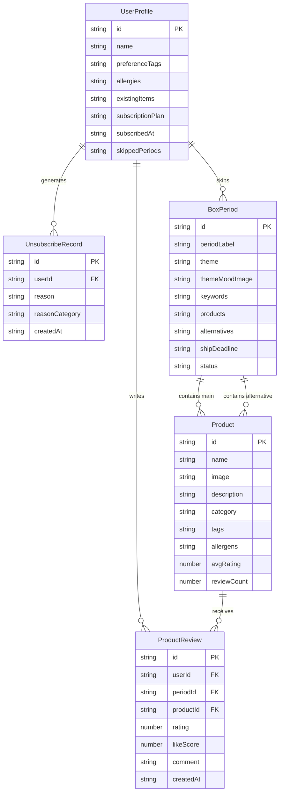

## 1. 架构设计

本平台采用纯前端单页应用架构，以 localStorage 模拟数据持久层，实现完整的订阅、配置、匹配与数据分析闭环。

```mermaid
flowchart LR
    subgraph "前端应用层 React"
        "用户端页面"["用户端页面"]
        "运营后台页面"["运营后台页面"]
        "状态管理 Zustand"["状态管理 Zustand"]
    end
    subgraph "业务逻辑层"
        "偏好匹配引擎"["偏好匹配引擎"]
        "选品算法模拟"["选品算法模拟"]
        "评价数据回流"["评价数据回流"]
    end
    subgraph "数据层"
        "localStorage 持久化"["localStorage 持久化"]
        "Mock 商品库"["Mock 商品库"]
        "Mock 订阅与评价数据"["Mock 订阅与评价数据"]
    end
    "用户端页面" --> "状态管理 Zustand"
    "运营后台页面" --> "状态管理 Zustand"
    "状态管理 Zustand" --> "偏好匹配引擎"
    "偏好匹配引擎" --> "选品算法模拟"
    "选品算法模拟" --> "评价数据回流"
    "状态管理 Zustand" --> "localStorage 持久化"
    "评价数据回流" --> "localStorage 持久化"
    "localStorage 持久化" --> "Mock 商品库"
    "localStorage 持久化" --> "Mock 订阅与评价数据"
```

## 2. 技术说明

- **前端框架**：React@18 + tailwindcss@3 + vite
- **初始化工具**：vite-init（react-ts 模板）
- **状态管理**：Zustand（轻量全局状态，含 localStorage 持久化中间件）
- **路由**：React Router@6（HashRouter 模式，便于静态部署）
- **动效**：Framer Motion（开箱动画、页面过渡、滚动渐显）
- **图表**：Recharts（数据分析后台的可视化图表）
- **3D 增强**：three + @react-three/fiber + @react-three/drei（首页盲盒 3D 展示，懒加载）
- **后端**：无（遵循"最小化外部服务"原则，使用 localStorage 模拟数据持久化）
- **数据库**：无外部数据库，数据模型以 TypeScript 类型定义并序列化存入 localStorage

## 3. 路由定义

| 路由 | 用途 |
|------|------|
| `/` | 落地首页：主视觉、运作机制、主题预告、套餐、口碑 |
| `/subscribe` | 订阅引导页：偏好标签、禁忌填写、套餐确认 |
| `/dashboard` | 用户中心：订阅概览、本期预告、跳过操作、历史记录 |
| `/unbox/:periodId` | 盲盒开箱页：开箱动画、逐件商品揭晓 |
| `/review/:periodId` | 商品评价页：对本期商品逐件评价 |
| `/admin` | 运营后台布局：侧栏导航 + 内容区 |
| `/admin/products` | 商品池管理：商品列表与编辑 |
| `/admin/boxes` | 盲盒配置：期次管理、商品组合、备选品、截止日期 |
| `/admin/analytics` | 数据分析：核心指标、退订原因、续订关键因素 |

## 4. API 定义（前端 Store 接口）

由于无后端，以下为 Zustand Store 暴露的核心接口（TypeScript 类型定义）：

```typescript
// 商品类型
interface Product {
  id: string;
  name: string;
  image: string;
  description: string;
  category: string;
  tags: string[];          // 偏好标签：运动/美食/美妆...
  allergens: string[];     // 含过敏成分
  avgRating: number;       // 历史平均评分
  reviewCount: number;
}

// 盲盒期次
interface BoxPeriod {
  id: string;
  periodLabel: string;     // 如 "2026年6月期"
  theme: string;
  themeDescription: string;
  themeMoodImage: string;
  keywords: string[];      // 预告关键词，不剧透商品
  products: string[];      // 主选商品 ID 组合
  alternatives: string[];  // 备选替换品 ID
  shipDeadline: string;    // 发货截止日期 ISO
  status: 'preview' | 'shipping' | 'delivered';
}

// 用户偏好档案
interface UserProfile {
  id: string;
  name: string;
  preferenceTags: string[];   // 偏好标签
  allergies: string[];       // 过敏成分
  existingItems: string[];   // 已有物品/避让品类
  subscriptionPlan: 'monthly' | 'quarterly' | 'annual';
  subscribedAt: string;
  skippedPeriods: string[];   // 已跳过的期次 ID
}

// 商品评价
interface ProductReview {
  id: string;
  userId: string;
  periodId: string;
  productId: string;
  rating: number;          // 1-5 星
  likeScore: number;       // 0-100 喜好度
  comment: string;
  createdAt: string;
}

// 退订记录
interface UnsubscribeRecord {
  id: string;
  userId: string;
  reason: string;
  reasonCategory: 'preference_mismatch' | 'allergy_conflict' | 'duplicate_item' | 'price' | 'low_value' | 'other';
  createdAt: string;
}

// Store 接口
interface AppStore {
  // 数据
  products: Product[];
  boxPeriods: BoxPeriod[];
  currentUser: UserProfile | null;
  reviews: ProductReview[];
  unsubscribes: UnsubscribeRecord[];

  // 用户操作
  createUserProfile: (profile: Omit<UserProfile, 'id' | 'subscribedAt' | 'skippedPeriods'>) => void;
  skipPeriod: (periodId: string) => void;
  submitReview: (review: Omit<ProductReview, 'id' | 'createdAt'>) => void;
  unsubscribe: (reason: string, category: UnsubscribeRecord['reasonCategory']) => void;

  // 运营操作
  addProduct: (product: Omit<Product, 'id' | 'avgRating' | 'reviewCount'>) => void;
  updateProduct: (id: string, patch: Partial<Product>) => void;
  deleteProduct: (id: string) => void;
  createBoxPeriod: (period: Omit<BoxPeriod, 'id' | 'status'>) => void;
  updateBoxPeriod: (id: string, patch: Partial<BoxPeriod>) => void;

  // 匹配引擎
  matchProductsForUser: (user: UserProfile, period: BoxPeriod) => string[];
  // 数据分析计算
  computeAnalytics: () => AnalyticsResult;
}
```

## 5. 服务器架构图

无后端服务，数据流完全在前端完成：

```mermaid
flowchart TD
    "React 组件"["React 组件"] --> "Zustand Store Actions"
    "Zustand Store Actions"["Zustand Store Actions"] --> "业务逻辑：匹配/算法/统计"
    "业务逻辑：匹配/算法/统计"["业务逻辑：匹配/算法/统计"] --> "persist 中间件"
    "persist 中间件"["persist 中间件"] --> "localStorage 序列化存储"
    "localStorage 序列化存储"["localStorage 序列化存储"] --> "初始 Mock 数据种子"
    "初始 Mock 数据种子"["初始 Mock 数据种子"] --> "Store 初始化"
    "Store 初始化"["Store 初始化"] --> "React 组件"
```

## 6. 数据模型

### 6.1 数据模型定义



### 6.2 数据定义语言（localStorage 种子数据结构）

由于使用 localStorage，DDL 体现为初始 Mock 数据种子脚本，在应用首次启动时写入：

```typescript
// 种子商品数据示例（共约 24 件，覆盖运动/美食/美妆/文创/科技/家居）
const SEED_PRODUCTS = [
  {
    id: 'p_001', name: '冷感运动毛巾', category: '运动',
    tags: ['运动', '户外'], allergens: [],
    description: '冰丝材质，运动即时降温',
    avgRating: 4.6, reviewCount: 128,
  },
  // ... 其余商品同理
];

// 种子盲盒期次示例
const SEED_BOX_PERIODS = [
  {
    id: 'bp_202606', periodLabel: '2026年6月期',
    theme: '仲夏夜之谜', keywords: ['清凉', '夜行', '灵感'],
    products: ['p_001', 'p_005', 'p_012'],
    alternatives: ['p_008', 'p_015'],
    shipDeadline: '2026-06-25T23:59:59',
    status: 'preview',
  },
  // ... 其余期次
];

// 种子评价与退订记录用于数据分析演示
const SEED_REVIEWS = [ /* 约 200 条评价 */ ];
const SEED_UNSUBSCRIBES = [ /* 约 40 条退订，覆盖各 reasonCategory */ ];
```

偏好匹配引擎核心算法（基于标签命中 + 禁忌过滤 + 评分加权）：

```typescript
// 匹配评分逻辑伪代码
function matchProductsForUser(user: UserProfile, period: BoxPeriod): string[] {
  const candidates = [...period.products, ...period.alternatives];
  // 1. 过滤禁忌：移除含用户过敏成分或与已有物品冲突的商品
  const safe = candidates.filter(pid => {
    const p = getProduct(pid);
    const hasAllergen = p.allergens.some(a => user.allergies.includes(a));
    const isDuplicate = user.existingItems.some(i => p.name.includes(i));
    return !hasAllergen && !isDuplicate;
  });
  // 2. 偏好匹配评分：标签命中数 * 2 + 历史平均评分
  const scored = safe.map(pid => {
    const p = getProduct(pid);
    const tagHits = p.tags.filter(t => user.preferenceTags.includes(t)).length;
    return { pid, score: tagHits * 2 + p.avgRating };
  });
  // 3. 取前 N 件作为本期发货组合（不足时回退备选品）
  return scored.sort((a, b) => b.score - a.score).slice(0, 3).map(s => s.pid);
}

// 续订关键因素分析（评价数据回流）
function computeAnalytics(): AnalyticsResult {
  // 统计各退订原因占比、各商品好评率、偏好匹配度与续订相关性
  // 识别影响续订的关键因素：偏好匹配度、禁忌冲突次数、本期好评率
}
```
